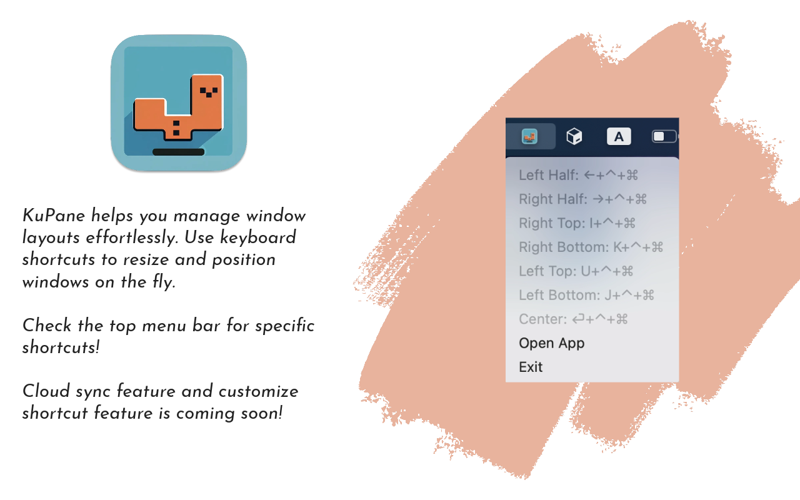
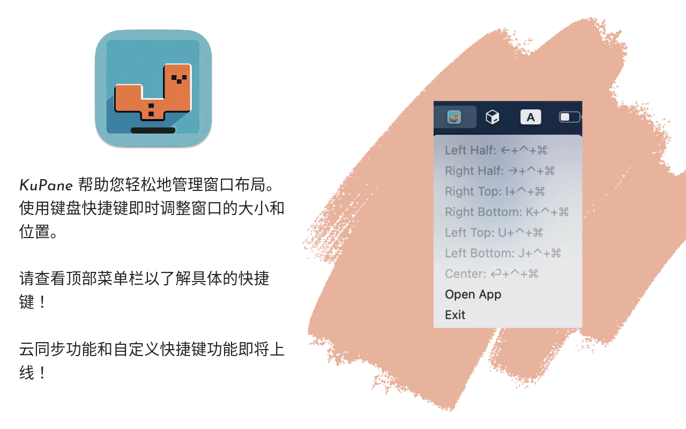

# KuPane

KuPane is an innovative utility for managing window layouts using keyboard shortcuts. Resize and position windows
effortlessly and improve your productivity.

[🫱Download Package🫲](KuPane.zip)



## Features
- Keyboard Shortcuts: Resize and position windows on-the-fly using intuitive keyboard shortcuts.
- Cloud Sync: Coming soon! Synchronize your custom layouts and shortcuts across devices.
- Customize Shortcuts: Feature coming soon! Personalize your workflow by setting up your own keyboard combinations.

## Installation
Clone the repository:

```bash
# Copy code
git clone https://github.com/[your-username]/KuPane.git
```

License
This project is licensed under the MIT License.
